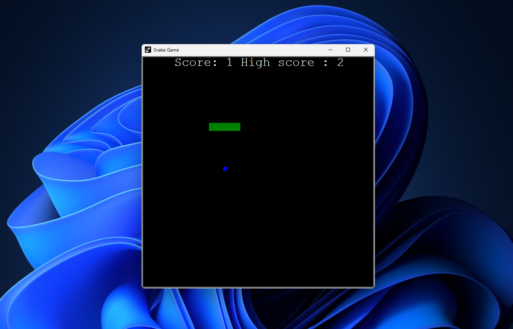

# Snake Game

  

## Overview

The Snake Game is a classic arcade game implemented using Python and the Turtle tkinter GUI library. It provides a nostalgic gaming experience where players control a snake to eat food and grow longer without colliding with the boundaries or themselves.

## Features

- Simple and intuitive controls using arrow keys.
- Keep track of your high score.
- Colorful graphics for an engaging gameplay experience.

## Gameplay

- Use the arrow keys to control the snake's direction.
- The snake will grow longer each time it consumes food.
- Avoid colliding with the boundaries or yourself to continue the game.
- The game ends when the snake collides with a boundary or itself.

## Requirements

- Windows machine

## Installation

1. Go to the Releases section of this repository.
2. Download the latest release (Snake_Game_v0.1.0.zip).
3. Extract the downloaded ZIP file to a location of your choice.
4. Double-click on snake-game.exe to start playing the game.

## High Score

- The game keeps track of your highest score achieved during gameplay.
- You can try to beat your own high score in subsequent sessions.
- To reset the high score set just delete the `data.txt` in the assets folder

## Screenshot

## Usage for the Developers

- It is OOP'ed so, its easier to understand:
- A `snake.py` module for the rendering snake's body and its functionalities: create the snake, move, event listeners(up, down, left, right), snake growth, and reset position.
- A `scoreboard.py` module for displaying the scoreboard on the screen.
- A `food.py` module for rendering the food on the screen.

## Configuration

You can customize the following parameters in `snake_game.py`:

- `GRID_SIZE`: Adjust the size of the game grid for larger or smaller gameplay area.
- `SNAKE_SPEED`: Set the snake's movement speed for different difficulty levels.
- `FOOD_APPEAR_INTERVAL`: Control how often food appears on the screen.

## Roadmap

- [ ] Add more customizable options for gameplay.
- [ ] Implement a multiplayer mode.
- [ ] Create additional themes for the game.

## Contributing

If you'd like to contribute, please fork the repository and create a pull request. Please make sure to update tests as appropriate.

## Support

If you encounter any issues or have suggestions, please [open an issue](https://github.com/muhzinkhan/snake-game/issues).

